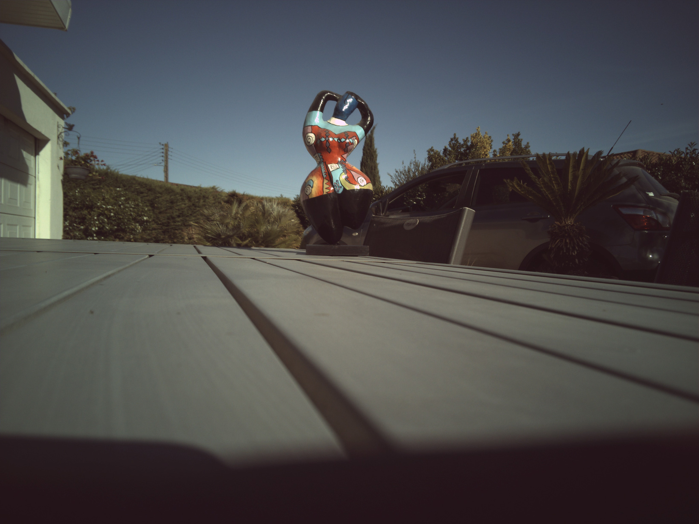
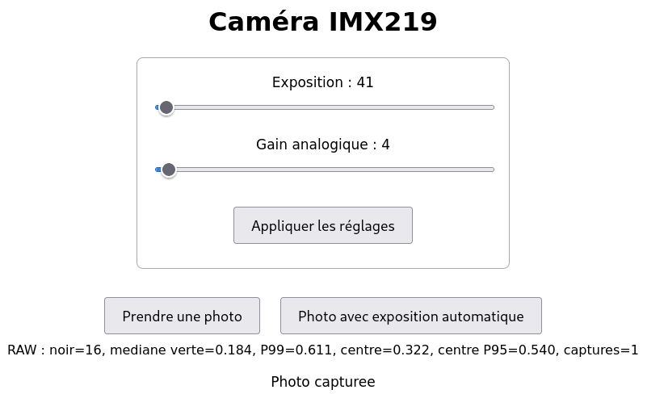

# IMX219 camera for Arduino App Lab — V2 automatic exposure

**V2 continues [the original IMX219 camera project (V1)](https://github.com/philippe86220/imx219-camera-with-arduino-app-lab).** Read the V1 README for the hardware, Arduino UNO Q and Media Carrier setup, App Lab installation, camera brick, Linux camera pipeline, Bayer-to-JPEG processing, and WebUI architecture. Those fundamentals still apply. This README explains the principal change in V2: **automatic exposure**, alongside the retained manual capture controls.

The familiar manual mode is still available. You can set exposure and analogue gain with the sliders, apply the settings, and click **Prendre une photo**. The additional **Photo avec exposition automatique** button measures successive RAW frames and adjusts exposure and analogue gain. Once the settings are chosen, the final RAW frame is converted into the displayed JPEG using the same image processing pipeline as V1.

## Taking photos and retaining manual control

1. Start the application as described in the [V1 README](https://github.com/philippe86220/imx219-camera-with-arduino-app-lab#readme).
2. For a **manual photo**, choose exposure and analogue gain with the sliders, click **Appliquer les réglages** to send these values to the sensor, then click **Prendre une photo**. Moving a slider alone changes its displayed number but does not apply it to the camera. Manual capture does not analyze the RAW image to select new settings.
3. For an **automatic photo**, click **Photo avec exposition automatique**. There is no need to click **Appliquer les réglages** first: the algorithm starts from whichever settings are currently applied to the camera, measures successive RAW frames, adjusts the controls, and displays the final JPEG. The sliders are updated to show the settings used for that image. The `RAW :` line shows the measurements from the final RAW frame.
4. To **take back manual control after an automatic photo**, move the sliders to the values you want, click **Appliquer les réglages**, then click **Prendre une photo**. If you want to keep exactly the settings selected by automatic mode, you can click **Prendre une photo** directly; clicking **Appliquer les réglages** first explicitly reapplies the displayed values. The next manual photo does not rerun automatic exposure, and its `RAW :` line is cleared.

Exposure is limited to **4–3522** and the IMX219 analogue gain control to **0–232**. These are sensor control values, not milliseconds or ISO numbers. An analogue gain setting of 0 corresponds to approximately 1× gain. The application starts with exposure 2200 and analogue gain 98; the automatic mode starts from the camera's current settings, which may include the previous automatic result.

## Automatic exposure algorithm: RAW measurements

A capture begins with a full-resolution **3280 × 2464**, 8-bit RGGB RAW frame. Before demosaicing, white balance, shadow correction, or JPEG encoding, the algorithm samples one position of the green Bayer channel every eight rows and columns. This keeps the measurement small compared with processing every pixel. Green is used as a simple brightness proxy; it does not directly measure the finished JPEG's apparent brightness.

The sampled values are corrected using a provisional RAW black level of **16** and normalized to a range of 0–1:

```text
corrected_green = max(raw_green - 16, 0) / (255 - 16)
```

The algorithm measures the whole frame for diagnostics and a central region for control. The central region spans approximately the middle **one third of the width** and **three fifths of the height** of the sampled image. It is a geometric region, not face or subject detection. The median is robust to a limited number of very bright pixels, while the central P95 adds a check on highlights occupying a noticeable part of the central region.

| WebUI field | Meaning |
| --- | --- |
| `noir` | Provisional black level subtracted from the 8-bit RAW samples (16). |
| `mediane verte` | Median corrected green value across the whole frame. |
| `P99` | Whole-frame 99th percentile: a diagnostic for very bright areas. |
| `centre` | Median corrected green value in the central region; the main brightness target. |
| `centre P95` | 95th percentile in the central region; used to restrain strong highlights there. |
| `captures` | Number of RAW frames captured during this automatic request, including the final one (1–6). |

A value close to **1.000** in a high percentile indicates that the measured part of the RAW image reaches the top of the corrected range. The whole-frame P99 is displayed for inspection; it does **not** force the algorithm to darken a centrally framed subject just because a bright background is present somewhere else.

## Automatic exposure algorithm: control loop

The central median has a provisional target of **0.35**. The control loop begins with the camera's currently applied exposure and analogue gain. It then repeats these steps for at most six RAW captures:

1. Configure the camera pipeline and capture a RAW frame with the current controls.
2. Compute the whole-frame and central-region green statistics above. Record the controls and measurements for this attempt in `history`.
3. Choose an adjustment factor from the central-region measurements using the rules below.
4. Stop if the result is close enough, the controls cannot change, or this was attempt six. Otherwise adjust the sensor controls and capture another RAW frame. A change of lighting between attempts can therefore change the result.

The adjustment factor represents the desired approximate ratio between the next RAW signal and the current RAW signal:

- If central P95 is at least **0.98**, the next settings aim to halve the measured signal; clipped RAW pixels do not show how far above the sensor limit the light level would have been.
- If central P95 exceeds **0.85**, the next adjustment aims to bring that percentile toward **0.80** without increasing brightness.
- Otherwise, the desired ratio is **0.35 / central median**. If the central median is below **0.01**, the ratio is set to 2 instead to avoid dividing by a near-zero value.
- Each adjustment factor is bounded to **0.5–2.0**. Thus a single iteration cannot request more than a doubling or more than a halving of the approximate RAW signal.

Before applying a proposed change, the loop stops if the factor lies between **0.90 and 1.10** and central P95 is no higher than **0.85**. The loop also stops if exposure and gain cannot change further, or after the sixth captured frame. If it stops at the sensor limits, the reported central median may still be far from the target.

### How exposure and gain share the adjustment

The gain register is not itself a linear brightness multiplier. The code approximates its multiplier as `gain_multiplier = 256 / (256 - gain_register)` and converts back using `gain_register = round(256 - 256 / gain_multiplier)`. Gain is bounded to register values **0–232**, and exposure to **4–3522**; rounding and sensor behavior mean the requested ratio is approximate.

When the image must become **darker** (`factor < 1`), the algorithm lowers analogue gain first. It calculates how much of the desired reduction gain achieved and applies the remainder by lowering exposure. When the image must become **brighter** (`factor >= 1`), it raises exposure first and applies any remaining increase with analogue gain. This favors lower gain when exposure has room to increase; in bright scenes it removes unnecessary amplification first.

Finally, **the last RAW frame already captured** is converted to JPEG. Therefore the displayed image, sensor settings, and RAW statistics all refer to the same frame. There is no extra, unmeasured final exposure. The `captures` count includes that final frame; a single capture means the previous sensor settings were accepted immediately.

### Example readings

- **Outdoor example with a colorful sculpture:** exposure **41**, analogue gain **4**, whole-frame green median **0.184**, whole-frame P99 **0.611**, central median **0.322**, and central P95 **0.540**. The result took **one RAW capture** because the current controls were already close to the target. The sculpture and sky remain visible, while the shaded car and foliage are considerably darker. The photo illustrates the trade-off in a high-contrast scene; it is not a claim that a RAW central median of 0.322 matches the brightness of every part of the processed JPEG.
- A strong outdoor light can lead to very low exposure and near-zero gain. In one test, the automatic result was exposure **41**, gain **4**, central median **0.351**, central P95 **0.552**, after **2** captures.
- A dim indoor scene can reach the opposite limits, exposure **3522** and gain **232**, while the subject remains dark: the camera cannot collect light that is not present.
- With a bright white door behind a person, the algorithm may preserve the central subject while the door loses highlight detail. One exposure cannot always retain both the brightest background and the shaded subject.

These are observations from the initial tests, not guaranteed camera settings for a particular lighting condition.



The corresponding WebUI capture shows the automatic settings and the final RAW measurements:



## Implementation path

```text
assets/index.html + assets/app.js
    → "prendre_photo_auto" WebUI message
python/main.py
    → Camera.capture_auto()
bricks/camera/__init__.py
    → GET /capture_auto on the local camera service
bricks/camera/camera_service.py
    → RAW measurements → sensor adjustments → final JPEG
    → "photo_update" containing image, settings, statistics, history
```

The existing manual path (`regler_camera`, `prendre_photo`, `/set_controls`, and `/capture`) remains available. The service serializes capture and sensor setting requests with a camera lock so manual and automatic requests do not change controls during each other's capture. `history` contains measurements and settings for each RAW attempt; the WebUI currently displays the final measurements and the number of attempts.

## Current limits and next experiments

The RAW black level **16** and target **0.35** are experimental choices; neither has been calibrated with a dark frame or color target. The central region cannot distinguish a face from a bright wall or door behind it. In mixed lighting, the central P95 can therefore influence the result even when its highlights belong to the background. White balance, shadow correction, contrast, and sharpening still operate on the final image as described in V1; their visible effect can differ from RAW statistics.

Indoor tests included ceiling light, a strong front light, and backlit portraits. Outdoor tests included sunlit walls, shadows, sky, and vegetation. These tests support keeping the current algorithm as the V2 baseline. Further changes to metering should be evaluated against the same scenes so that a gain in one situation does not make another worse.

The V1 source and full architecture explanation remain at [philippe86220/imx219-camera-with-arduino-app-lab](https://github.com/philippe86220/imx219-camera-with-arduino-app-lab).

## Acknowledgements

I built and tested this project with an Arduino UNO Q, an Arduino UNO Media Carrier, and an IMX219 camera. I carried out the indoor and outdoor experiments, compared the manual and automatic results, and evaluated the photographs.

OpenAI's ChatGPT (Codex) helped me develop the V2 automatic exposure algorithm, integrate it into the WebUI, interpret the RAW measurements, and write this documentation. We refined the algorithm together using my photographs and measurements.
